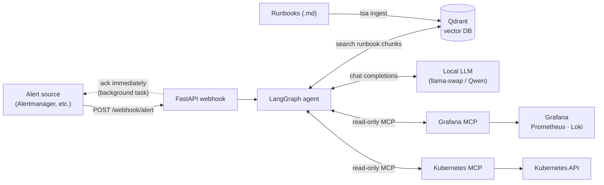
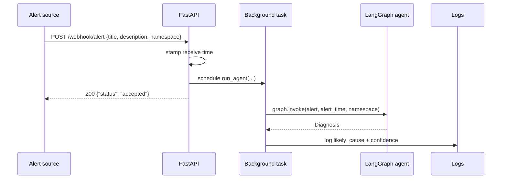
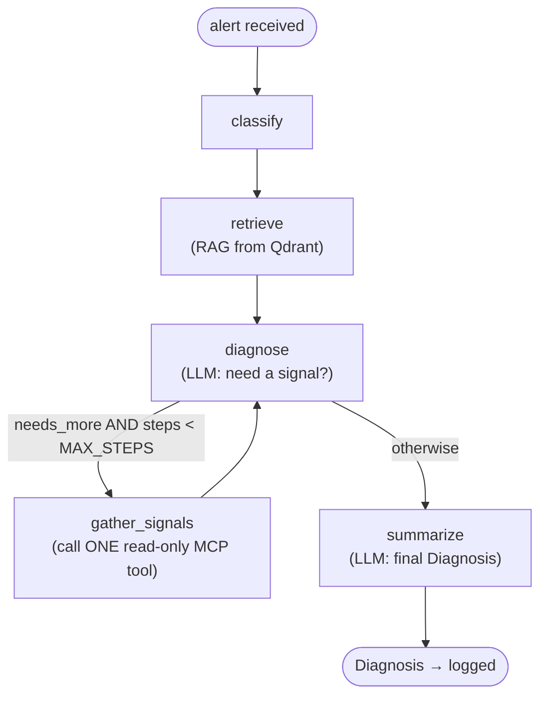

# pharos-sre-bot

A proof-of-concept **on-call troubleshooting agent**. It receives an infrastructure
alert over a webhook, retrieves relevant runbook snippets via RAG, then runs a
LangGraph agent loop that reasons about the alert — optionally pulling **live,
read-only** Grafana and Kubernetes signals through MCP — and emits a structured
`Diagnosis`.

> **Status: PoC.** The diagnosis is currently written to the logs, not returned to
> the caller. The webhook acknowledges the alert immediately and runs the agent in
> a background task.

Python package: `troubleshooting_agent` · console entry point: `tsa` · deployed as
`pharos-sre-bot`.

---

## How it works

### System architecture



The vector store is populated out-of-band by `tsa ingest`, which chunks runbook
markdown and embeds it into Qdrant. At request time the agent searches that store
for context.

### Request lifecycle



### The agent (LangGraph state machine)

The heart of the system is a LangGraph graph in `agent.py`. The
**diagnose ↔ gather_signals loop** is the core control flow: `diagnose` asks the
LLM whether it needs one more live signal (emitting a `SignalRequest` JSON);
`should_continue` loops back to fetch exactly that one signal if `needs_more` is
set **and** the step count is still under `MAX_STEPS`, otherwise it proceeds to
`summarize`.



| Node | Responsibility |
|------|----------------|
| `classify`    | Seed state from the incoming alert; reset the step counter. |
| `retrieve`    | Embed the alert and pull the top-k runbook chunks from Qdrant. |
| `diagnose`    | Ask the LLM to reason; it may request **one** live signal as a `SignalRequest` (`tool` / `arguments` / `reason`). |
| `gather_signals` | Execute the single requested MCP tool (read-only) and append its output to state. |
| `summarize`   | Produce the final structured `Diagnosis` (likely cause, confidence, checks performed, next steps, sources). |

---

## Quick start (local development)

Dependencies and runtime are managed with [**uv**](https://docs.astral.sh/uv/)
(not pip/poetry). Requires Python 3.12+.

```bash
# 1. Install dependencies (add --dev for pytest/httpx)
uv sync

# 2. Configure: copy the dev profile to the file the app loads
cp .env-dev .env        # then edit .env for your environment

# 3. Start local backing services (Qdrant + Grafana MCP + Kubernetes MCP)
docker compose up -d

# 4. Ingest runbooks into Qdrant (reads LOCAL_RUNBOOK_PATH etc.)
uv run tsa ingest

# 5. Run the API (uvicorn, on :7070)
uv run tsa api
```

Send a test alert:

```bash
curl -X POST http://localhost:7070/webhook/alert \
  -H 'Content-Type: application/json' \
  -d '{"title": "PodCrashLooping", "description": "checkout-api restarting", "namespace": "shop"}'
```

The diagnosis appears in the server logs. Raise verbosity with `LOG_LEVEL=DEBUG`
(tool calls + results) or `LOG_LEVEL=TRACE` (full prompts and raw LLM responses).

---

## Configuration

Configuration is loaded from a `.env` file at the repo root by
[pydantic-settings](https://docs.pydantic.dev/latest/concepts/pydantic_settings/).
Every field in `config.py` maps 1:1 to an `UPPER_SNAKE_CASE` environment variable.

`.env-dev` is a committed-but-gitignored **local dev profile** — copy it to `.env`.
`.env.example` is the template. Production values are injected as real environment
variables (see Deployment); `LLM_BASE_URL`, `LLM_API_KEY`, and `MODEL` ship empty
by default and **must** be set per deployment.

| Variable | Default | Notes |
|----------|---------|-------|
| `LLM_BASE_URL` | *(empty)* | OpenAI-compatible endpoint. Required. |
| `LLM_API_KEY` | *(empty)* | Required (use any non-empty value for a keyless local endpoint). |
| `MODEL` | *(empty)* | Model id served by the endpoint. Required. |
| `MAX_STEPS` | `6` | Upper bound on the diagnose ↔ gather_signals loop. |
| `VECTOR_DB_URL` | `http://localhost:6333` | Qdrant. Overridden by the Helm chart's sidecar URL. |
| `VECTOR_DB_API_KEY` | *(none)* | Set for an external/managed Qdrant. |
| `COLLECTION_NAME` | `runbooks` | Qdrant collection. |
| `LOCAL_RUNBOOK_PATH` | `/runbooks` | Ingestion source dir (chart ConfigMap mount). |
| `GIT_RUNBOOK_URL` | *(none)* | Stub — git ingestion not implemented yet. |
| `NOTION_TOKEN` | *(none)* | Stub — Notion ingestion not implemented yet. |
| `GRAFANA_MCP_URL` | `http://localhost:9000/mcp` | Grafana MCP endpoint. |
| `GRAFANA_PROMETHEUS_UID` | `prometheus` | Datasource UID auto-injected into `query_prometheus`. |
| `K8S_MCP_URL` | `http://localhost:9001/mcp` | Kubernetes MCP endpoint. |
| `HOST` / `PORT` | `0.0.0.0` / `7070` | API bind address. |
| `LOG_LEVEL` | `INFO` | `TRACE` < `DEBUG` < `INFO` < … |

> The Grafana MCP server authenticates to Grafana with
> `GRAFANA_SERVICE_ACCOUNT_TOKEN` (consumed by the MCP container, not by this app).
> Keep that token read-only.

### Note on the LLM stack

The target LLM is a local llama-swap/Qwen endpoint, not a hosted Anthropic/OpenAI
model. Strict `json_schema` response formatting **hangs** on this stack, so
`summarize` uses `{"type": "json_object"}` plus field descriptions in the prompt
and validates the result client-side. All calls disable thinking via
`extra_body={"chat_template_kwargs": {"enable_thinking": False}}`.

---

## API

| Method | Path | Description |
|--------|------|-------------|
| `POST` | `/webhook/alert` | Accepts an alert, schedules the agent, acks immediately. |
| `GET`  | `/healthz` | Liveness/readiness probe target. |

**`POST /webhook/alert`** body (`AlertPayload`):

```json
{
  "title": "string (required)",
  "description": "string (optional)",
  "namespace": "string | null (optional)"
}
```

Returns `{"status": "accepted"}`. The `namespace`, when provided, is passed to
Kubernetes tools and used as a label hint for Prometheus queries.

---

## Read-only safety model

The agent can reach live infrastructure, so reads are constrained by construction:

- Each MCP provider hard-codes an **allowlist** of read-only tool names
  (`ALLOWED_GRAFANA_TOOLS`, `ALLOWED_K8S_TOOLS`). The Grafana MCP server advertises
  ~56 tools, some of which mutate state; only allowlisted names are shown to the
  LLM **and** `call_tool` raises `PermissionError` on anything else.
- This sits on top of read-only service accounts / `--read-only` MCP server flags —
  defense in depth.
- Each `diagnose` turn fetches **at most one** signal, and the loop is bounded by
  `MAX_STEPS`.

When adding a tool to an allowlist, confirm it cannot mutate state first.

---

## Repository layout

```
src/troubleshooting_agent/
  api.py          FastAPI app factory; webhook + healthz; background agent run
  agent.py        LangGraph state machine (classify → retrieve → diagnose ↔ gather → summarize)
  vectorstore.py  Qdrant wrapper (the only module importing qdrant_client)
  embeddings.py   fastembed BAAI/bge-small-en-v1.5 (384-dim) — data contract with the collection
  ingest.py       Markdown chunking + upsert (git/Notion ingestion are stubs)
  config.py       pydantic-settings; one field per env var
  logging.py      adds a custom TRACE level below DEBUG
  cli.py          `tsa api` and `tsa ingest`
  tools/          signal layer: base Protocol, Grafana + Kubernetes MCP wrappers, registry
chart/pharos-sre-bot/   Helm chart (agent + optional Qdrant/Grafana/K8s MCP sidecars)
runbooks/               sample runbooks
scripts/                helpers to dump the tool list an MCP server advertises
```

---

## Deployment

- **Docker** — `Dockerfile` is a multi-stage uv build; the runtime image runs as a
  non-root `sre` user, entrypoint `tsa`, default command `api`, exposing `7070`.
- **Helm** — `chart/pharos-sre-bot/` deploys the agent with optional in-pod sidecars
  (Qdrant, Grafana MCP, Kubernetes MCP) toggled in `values.yaml`. `agent.env` keys
  map 1:1 to the settings; the derived URLs (`VECTOR_DB_URL`, `GRAFANA_MCP_URL`,
  `K8S_MCP_URL`) are computed by the chart from the sidecar toggles.
  **No ingress by design** — alert sources reach the webhook in-cluster (ClusterIP).
  The chart creates no Secret; wire `LLM_API_KEY` / `GRAFANA_SERVICE_ACCOUNT_TOKEN`
  via `extraEnv` / `envFrom`. `kubernetesMcp.rbac.scope` selects cluster-wide vs
  per-namespace read-only RBAC.
- Runbooks ship two ways: ingested from a path/git into Qdrant, or mounted via the
  chart's `runbooks/` ConfigMap.

## CI

`.github/workflows/build.yml` builds and pushes a multi-stage Docker image to GHCR
**only on `v*` tags**. A test job is scaffolded but currently commented out (there
is no test suite yet).
